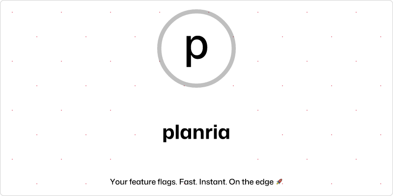

# planria

  

This is a Software as a Service (SaaS) tool for feature flags.

This is an open-source (licensed under the [Apache 2.0 license](./LICENSE)) because we believe in
transparency towards our customers and that the things meant for developers should be evaluated
and supported by developers.

> Infrastructure. Edge. Feature Flags. Remote Config.
> A/B tests. No fuss. No hassle.

Planria is the complete platform for managing your feature flags, remote config,
and A/B tests. Deploy with confidence and make data-driven decisions.

Planria provides a comprehensive set of tools to help you manage your feature flags,
remote config, and A/B tests with ease.

- **Feature Flags:** Easily manage and deploy feature flags across your application.
- **Remote Config:** Dynamically configure your application without redeploying.
- **A/B Testing:** Run experiments and make data-driven decisions about your application.

Planria was founded in 2024 with the mission to make feature management easy and accessible
for teams of all sizes. Our platform and infrastructure provide a comprehensive set of tools
to help you manage feature flags, remote config, and A/B tests with ease.
